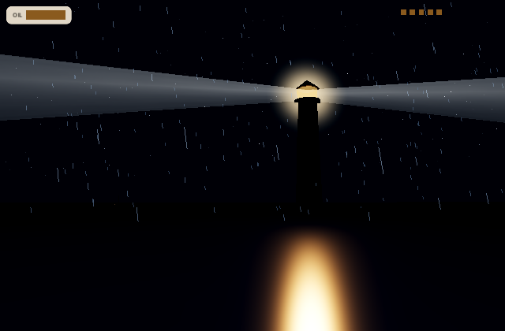

# Keep the Light

The lighthouse lamp died an hour before dawn. Five lens panes blew out in the storm. Climb, find the panes, relight the lamp.



**Live:** https://aeiouvcode.github.io/keep-the-light/

## About

A short first-person lighthouse game for browser and phone. Search the tower, the oil store and the sea cave for the five missing lens panes while the oil timer burns down, carry them up the scaffold stairs, cross the broken gap, and fit them into the lens before first light. Fit all five and the lamp roars back to life; run out of oil and the night is lost.

## Controls

| Key | Action |
| --- | --- |
| WASD / arrows | Move |
| Mouse / drag | Look |
| E / tap prompt | Pick up, interact |
| Space / JUMP button | Jump |
| Touch | Left half joystick, right half look, context button |

## Built with

Godot 4.3 (web export, single-threaded so it runs on plain static hosting). Every texture, sound and 3D asset is generated in code - no external art or audio files.

## Run locally

```sh
git clone https://github.com/aeiouvcode/keep-the-light.git
cd keep-the-light
python3 -m http.server 8000
```

Then open http://localhost:8000.

## Layout

```
index.html, index.js, index.wasm, index.pck   web build (served by GitHub Pages)
godot/                                        Godot project source (main.gd is the whole game)
docs/                                         README assets
```
